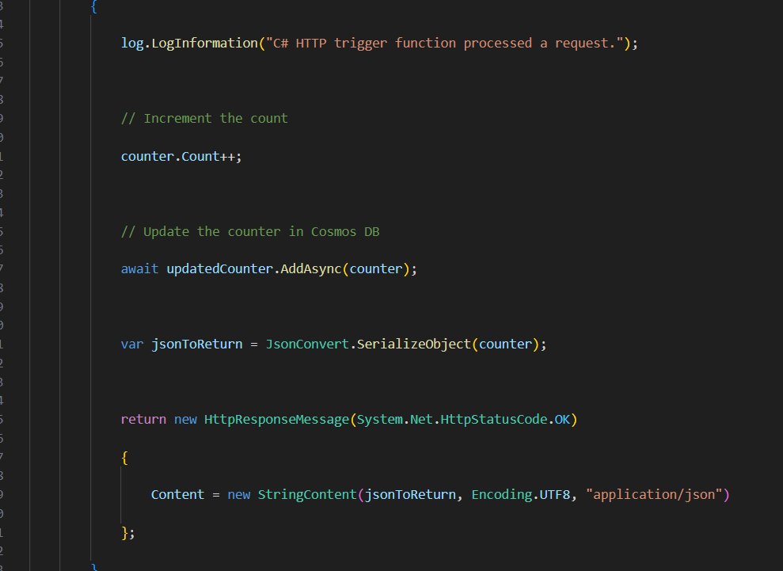

# azure-portfolio
My own azure portfolio website

Creating a potfoli website which will hold resume and project documentation of all projects i created 
## components 
- azure static web app
- azure function
- azure cosmos db
- github actions

## Section 1: Building the frontend
 - Created html page to contain Resume info and add resume information
 

- adding the documentation of all the project

### implemented javascript code for the visitor counter
 
 It is a JavaScript function called getVisitCount(). This function uses the Fetch API to call an Azure Function called GetResumeCounter. The GetResumeCounter function returns a JSON object containing the current value of a counter.

The getVisitCount() function works as follows:

    1) It first sets a local variable called count to the value 30.

    2) It then uses the Fetch API to call the GetResumeCounter function.

    3) The Fetch API returns a promise, which is an object that represents the eventual completion or failure of an asynchronous operation.

    4) The getVisitCount() function then uses the then() method on the promise to handle the successful completion of the request.

    5) The then() method takes a callback function as an argument. This callback function is called when the request is successful and the response is available.

    6) The callback function in the getVisitCount() function first logs a message to the console indicating that the website called the function API.

    7) It then updates the count variable with the value of the count property in the JSON response.

    8) It finally updates the text content of the HTML element with the ID counter with the new value of the count variable.

    9) If the request fails, the getVisitCount() function logs the error to the console.

The getVisitCount() function is called when the DOMContentLoaded event is fired. The DOMContentLoaded event is fired when the initial HTML document has been completely loaded and parsed, without waiting for stylesheets, images, and subframes to finish loading.

This function can be used to implement a simple counter that tracks the number of times a website has been visited. The counter value is stored in an Azure Function, so it can be persisted across different sessions and devices.

## Section 2: Building the backend
### Setting up our cosmos DB resources 

We are setting up our cosmos DB resources to store the counter data which is the Number of times the Html page was parsed 
- Create a cosmos DB account and deploy it

- after deploying we will create a database inside the account 
- And inside the database we will create the container which will hold the data inside a item

The data we are storing is a count (which is the Number of times the Html page was parsed)

### Setting up Azure function 
Azure Functions is an event-driven, serverless compute platform that helps you develop more efficiently using the programming language of your choice.
Fuctions have bindings which also us to connect other resources to our function

We will use azure extention in visual studio code to create function
- Click on Create new project and use httptrigger template 

After creating the function go in local.setting.json to store connnection key so we can add bindings to function (this file doesnt got push to github so dont worry about exposing the key)

- go on azure portal inside the cosmon db account, go to keys section and copy the "PRIMARY CONNECTION STRING" to the local.setting.json

- We need to add a Class so that we can describe the counter object

Inside the "Company.Function" namespace, there is a class named "Counter." It has two properties:

    Id property: This is a string that represents an ID. The [JsonProperty(PropertyName = "id")] attribute is used to specify that when this class is converted to JSON, the property name in the JSON will be "id."

    Count property: This is an integer that represents a count. The [JsonProperty(PropertyName = "count")] attribute is used to specify that in the resulting JSON, the property name will be "count."

now we are going to create bindings

there are two bindings in the image 
- 1st binding tells the function to read the counter document with the ID 1 from the Counter container in the AzureResume database. The Connection property specifies the connection string to the Azure Cosmos DB account.
- 2nd binding tells the function to write the counter document to the Counter container in the AzureResume database. The IAsyncCollector<Counter> type is used to collect the counter documents that need to be updated.

- Once the counter has been updated, the function returns a JSON response containing the updated counter value.

we can test this locally after lauching the function locally we can see that the counter gets updated 

## Section 3: Deploying to Azure

We'll deploy our azure function to azure, we need to add a application setting for the cosmos db key (because local.setting.json file doesnt get push to github)

- copy the "PRIMARY CONNECTION STRING" and go to azure portal, function app configuration and paste the key inside a new application setting

After that grab the fuction url and update our javascript code with it

- deploy to azure static web apps

when asked give it location of app and api

after that we need to add the website url in function cors 
- Cross-Origin Resource Sharing (CORS) is a security feature that restricts cross-domain HTTP requests. By default, browsers block requests to resources hosted on a different domain than the current page. CORS allows the server to specify which origins are allowed to access its resources.
we'll deploy our static site to our blob container

The Azure Static Web Apps build configuration is powered either by GitHub Actions or Azure Pipelines. Each site has a YAML configuration file that controls how a site is built and deployed.

 Azure Static Web Apps comes with built-in support for GitHub Actions. GitHub Actions is a continuous integration and continuous delivery (CI/CD) platform that allows you to automate your software development and deployment workflows.

Azure Static Web Apps uses GitHub Actions to automatically build and deploy your static web app to Azure when you push changes to your GitHub repository. This allows you to have a continuous deployment pipeline, which means that your web app will always be up-to-date with the latest changes.

### And we are done!!

We have built a portfoli/resume website on Azure with static web apps, Fuctions, CosmosDB and GitHub Actions

